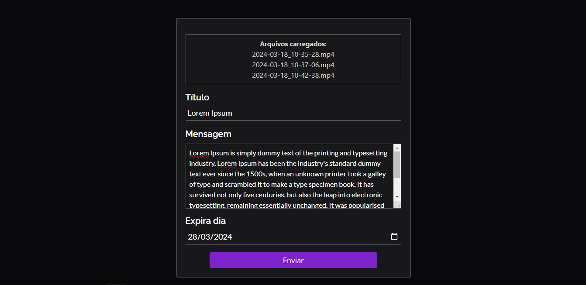
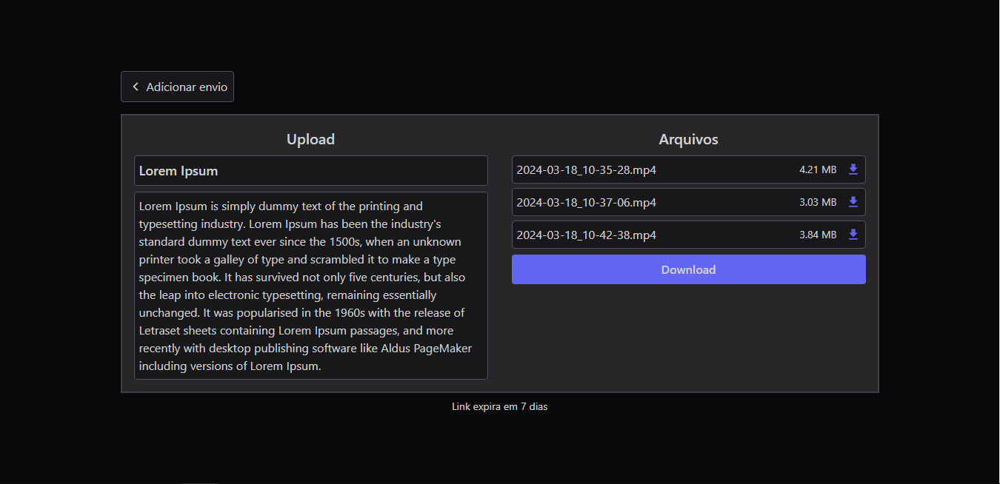

# `remote-file-transfer`

Project created based on [wetransfer](https://wetransfer.com/) websile. Covering all files operations, to be able to transfer files throught a single link.

## Upload Page

## Download Page

## Frontend Routes

- `/`: The upload page, used to upload the files, with title, message and expiration date, returns a link to the download page as result;
- `/:uploadId`: The download page to select wich files you want to download, or download a zip file with everything included;

## Backend Routes

- `POST /upload`: Handle the files with the option to include title and message;
- `GET /upload/:uploadId`: Returns the sent upload data with a list of files;
- `GET /download/upload/:uploadId`: Downloads a zip with the uploaded files included;
- `GET /download/file/:fileId`: Downloads the specified file from the uploaded data;
